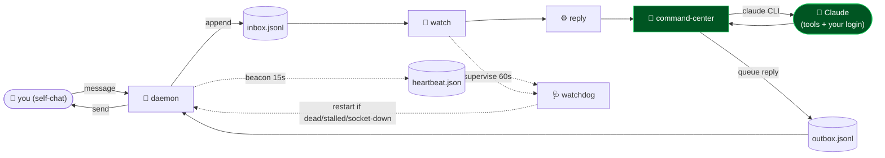

<!-- WhatsApp Command Channel — white-label. No personal or company identifiers in this file by design. -->

<p align="center">
  
</p>

<h1 align="center">📩 WhatsApp Command Channel</h1>

<p align="center">
  <b>Turn your own WhatsApp into a command center for Claude — text it, and Claude does the work and texts back.</b><br>
  <sub>A tiny, self-hosted bridge over the open WhatsApp Web protocol. Message yourself and the command center hands it to Claude — running as a real agent with tools via the <code>claude</code> CLI and <b>your own Claude login</b> — then sends the answer back. One socket, file-based inbox/outbox, pair once with your number. No business API, no third-party server, <b>no API key</b>. The same Claude you already use at the terminal; the bridge itself is $0.</sub>
</p>

<p align="center">

= 18">


</p>

<p align="center">
<code>whatsapp</code> · <code>claude</code> · <code>command-center</code> · <code>agent</code> · <code>self-hosted</code> · <code>no-business-api</code> · <code>no-api-key</code>
</p>

---

## Why WhatsApp Command Channel

You already carry WhatsApp everywhere. This turns it into a private remote control for Claude: text a request, and Claude — running as a real agent with tools on your own machine, under **your own Claude login** — actually does the work and texts you the result. No business API, no relay server, no app to build, **no API key**. It's ~350 lines over the open WhatsApp Web protocol: it holds one connection, writes every message you send yourself to an inbox file, routes it to Claude, and sends the reply back. Pair once with your number and it's yours. Don't have the `claude` CLI installed? It degrades to a plain notify/command channel with a $0 acknowledgement handler.

---

## What it does

| Module | What it does | Signal |
|---|---|---|
| **command-center** | Routes each inbound message to Claude (the `claude` CLI with tools, your own login) and replies | the brain |
| **daemon** | Holds one WhatsApp connection; inbound → inbox file, drains outbox → send. Writes a liveness beacon | single socket |
| **watch** | Watches the inbox and triggers the handler the instant a message lands; supervises the daemon every 60s | event-driven, $0 |
| **watchdog** | Reads the daemon's beacon and restarts it if it's dead, stalled, stacked, or silently dropped its socket | 24/7 self-heal |
| **reply** | The default handler — invokes the command-center (or your own custom logic) | swap in yours |
| **connect** | One-time pairing: 8-digit code or QR, stored to a local session | pair once |
| **send** | One-shot sender for scripts that just need to notify you | fire-and-forget |

### The command center — two modes (auto-detected)

| Mode | When | What you get |
|---|---|---|
| **`cli`** | the `claude` CLI is installed | **Full agent.** Runs `claude -p` with tools + **your own Claude login** (no API key, nothing metered), remembering context across messages. Text "check disk usage and clean the biggest logs" and it *does* it. This is the whole point. |
| **`ack`** | no CLI installed | **$0 fallback.** Acknowledges receipt so the loop is verifiable — a plain notify/command channel. |

Override detection with `CC_MODE=cli\|ack`. Tool permissions, system prompt, working dir, and timeout are all env-configurable — see `.env.example`.

---

## Architecture



---

## Quickstart

```bash
# 1. install
npm install

# 2. set your number, then pair once (prints an 8-digit code)
cp .env.example .env      # put YOUR number in WA_TO
node connect.cjs --pair=15551234567

# 3. (optional) wire in Claude:
#    • install the `claude` CLI and log in  → full agent-with-tools mode
#    (skip this and it runs as a $0 ack channel — no API key, ever)

# 4. run the bridge — daemon + watcher
node wa-daemon.cjs &     # holds the connection, writes a liveness beacon
node wa-watch.cjs        # routes each message to Claude + supervises the daemon 24/7
```

> **Setup: your number in `.env`, pair once, run two processes.** Everything is local — the session lives on your machine, messages never touch a third-party server. Now text yourself on WhatsApp and Claude answers. Try the handler standalone against your inbox with `node command-center.cjs`.
>
> **Stays up on its own.** `wa-watch` supervises the daemon every 60s off its heartbeat beacon: if the daemon dies, stalls, double-launches, or silently drops its socket (connected but no longer receiving), the watchdog kills the stragglers and relaunches exactly one. Run `node wa-watchdog.cjs` for a one-shot manual check. For a hands-off box, run the two processes under a supervisor (pm2, systemd, or a login/Startup item) so they come back after a reboot.

---

## Repository layout

```
whatsapp-command-channel/
├── command-center.cjs ← routes a message to Claude (the `claude` CLI) or a $0 ack, and replies
├── wa-daemon.cjs      ← holds the connection, inbox in / outbox out, liveness beacon
├── wa-watch.cjs       ← fires the handler the instant a message lands + supervises the daemon
├── wa-watchdog.cjs    ← restarts the daemon if it dies / stalls / stacks / drops its socket
├── wa-reply.cjs       ← the default handler (calls the command-center; swap in your own logic)
├── connect.cjs        ← one-time pairing (code or QR)
├── send.cjs           ← one-shot notifier for other scripts
└── .env.example       ← your number + optional Claude config
```

---

## Design principles

1. **Yours, end to end.** One socket to WhatsApp Web, a local session, file-based inbox/outbox — no business API, no relay server, no API key. You use your own Claude login; nothing routes through anyone else.
2. **Claude with tools, remotely.** The command center runs the real `claude` agent on your machine, so a text can actually *do* work — not just chat.
3. **Degrades gracefully.** No `claude` CLI installed → a $0 ack channel. Everything is auto-detected and overridable.
4. **Owner-only by default.** The daemon only acts on messages from your own number — drop in an allow-list to extend it.
5. **Stays up on its own.** Heartbeat beacon + watchdog restart the bridge if it dies, stalls, stacks, or silently drops its socket.

---

<p align="center"><sub>WhatsApp Command Channel · text Claude, it works + replies · one socket · pair once · MIT</sub></p>
