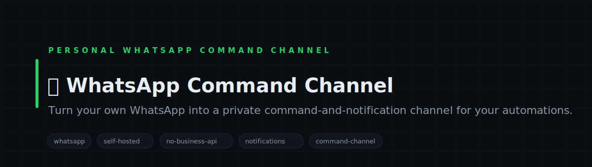
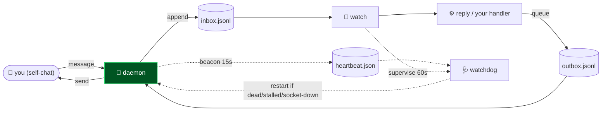

<!-- COURIER — white-label. No personal or company identifiers in this file by design. -->

<p align="center">
  
</p>

<h1 align="center">📩 COURIER</h1>

<p align="center">
  <b>Turn your own WhatsApp into a private command-and-notification channel for your automations.</b><br>
  <sub>A tiny, self-hosted bridge: message yourself on WhatsApp to trigger your scripts, and let your scripts message you back. One socket, file-based inbox/outbox, pair once with your number — no business API, no third-party server.</sub>
</p>

<p align="center">

= 18">

</p>

<p align="center">
<code>whatsapp</code> · <code>self-hosted</code> · <code>no-business-api</code> · <code>notifications</code> · <code>command-channel</code> · <code>$0</code>
</p>

---

## Why COURIER

You want your scripts to ping you and take commands where you already are — WhatsApp — without signing up for a business API or routing your messages through someone else's server. COURIER is ~350 lines over the open WhatsApp Web protocol: it holds one connection, writes every message you send yourself to an inbox file, and sends anything your code drops in the outbox. Pair once with your number and it's yours.

---

## What it does

| Module | What it does | Signal |
|---|---|---|
| **daemon** | Holds one WhatsApp connection; inbound → inbox file, drains outbox → send. Writes a liveness beacon | single socket |
| **watch** | Watches the inbox and triggers a handler the instant a message lands; supervises the daemon every 60s | event-driven, $0 |
| **watchdog** | Reads the daemon's beacon and restarts it if it's dead, stalled, stacked, or silently dropped its socket | 24/7 self-heal |
| **reply** | The handler you customize — turn an inbound message into an action + reply | your logic here |
| **connect** | One-time pairing: 8-digit code or QR, stored to a local session | pair once |
| **send** | One-shot sender for scripts that just need to notify you | fire-and-forget |

---

## Architecture



---

## Quickstart

```bash
# 1. install
npm install

# 2. set your number, then pair once (prints an 8-digit code)
cp .env.example .env      # put YOUR number in WA_TO
node connect.cjs --pair=15551234567

# 3. run the bridge — daemon + watcher
node wa-daemon.cjs &     # holds the connection, writes a liveness beacon
node wa-watch.cjs        # fires your handler on each message + supervises the daemon 24/7
```

> **That's the whole setup: put your number in `.env`, pair once, run two processes.** Everything is local — the session lives on your machine, messages never touch a third-party server.
>
> **Stays up on its own.** `wa-watch` supervises the daemon every 60s off its heartbeat beacon: if the daemon dies, stalls, double-launches, or silently drops its socket (connected but no longer receiving), the watchdog kills the stragglers and relaunches exactly one. Run `node wa-watchdog.cjs` for a one-shot manual check. For a hands-off box, run the two processes under a supervisor (pm2, systemd, or a login/Startup item) so they come back after a reboot.

---

## Repository layout

```
courier/
├── wa-daemon.cjs   ← holds the connection, inbox in / outbox out, liveness beacon
├── wa-watch.cjs    ← fires your handler the instant a message lands + supervises the daemon
├── wa-watchdog.cjs ← restarts the daemon if it dies / stalls / stacks / drops its socket
├── wa-reply.cjs    ← the handler you customize (message → action → reply)
├── connect.cjs     ← one-time pairing (code or QR)
├── send.cjs        ← one-shot notifier for other scripts
└── .env.example    ← your number goes here
```

---

## Design principles

1. **Yours, end to end.** One socket to WhatsApp Web, a local session, file-based inbox/outbox — no business API, no relay server.
2. **Pair once.** Set your number, pair a single time; the session persists.
3. **Event-driven & free.** A file-watch (not a poll) triggers your handler the moment a message arrives.
4. **Owner-only by default.** The daemon only acts on messages from your own number — drop-in an allow-list to extend it.

---

<p align="center"><sub>COURIER · one socket · file inbox/outbox · pair once · MIT</sub></p>
