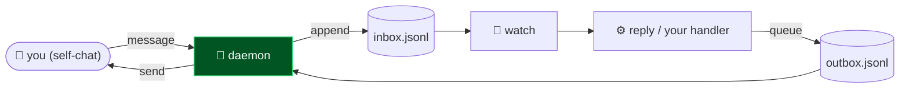

# WhatsApp Command Channel — Architecture

A tiny, self-hosted bridge: message yourself on WhatsApp to trigger your scripts, and let your scripts message you back. One socket, file-based inbox/outbox, pair once with your number — no business API, no third-party server.

## Flow

## How it fits together

WhatsApp Command Channel is one long-lived process plus a couple of helpers. `wa-daemon.cjs` owns the single WhatsApp connection and does both directions: inbound messages from your own number are appended to `memory/inbox.jsonl`, and anything queued in `memory/outbox.jsonl` is sent and logged. `wa-watch.cjs` watches the inbox file and spawns `wa-reply.cjs` the instant something lands — that reply handler is the part you customize into a real command dispatcher. `connect.cjs` handles one-time pairing; `send.cjs` is a standalone notifier for scripts that only need to message you (don't run it while the daemon is up — there's only one socket).

## Extending it

Every capability is a self-contained module. To add your own, follow the contract the existing
modules use and wire it into the entry point. Keep it portable — config via `.env`, no hardcoded
paths, no personal accounts.

## Design principles

1. **Yours, end to end.** One socket to WhatsApp Web, a local session, file-based inbox/outbox — no business API, no relay server.
2. **Pair once.** Set your number, pair a single time; the session persists.
3. **Event-driven & free.** A file-watch (not a poll) triggers your handler the moment a message arrives.
4. **Owner-only by default.** The daemon only acts on messages from your own number — drop-in an allow-list to extend it.
